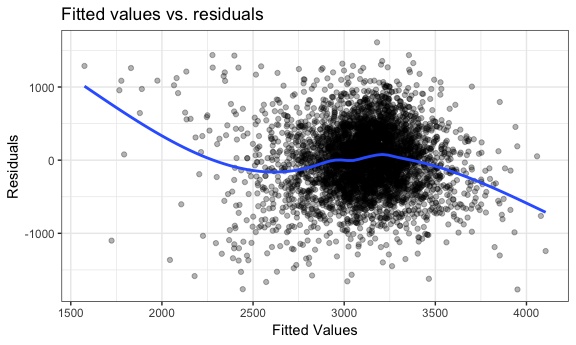

p8105\_hw5\_dry2115
================
Dayoung Yu
2018-11-25

### Problem 1

Read in and clean *Washington Post* homicide data.

``` r
homicide_df = 
  read_csv("data/homicide-data.csv", na = c("", "NA", "Unknown")) %>%
  mutate(
    city_state = str_c(city, state, sep = ", "),
    resolution = case_when(
      disposition == "Closed without arrest" ~ "unresolved",
      disposition == "Open/No arrest"        ~ "unresolved",
      disposition == "Closed by arrest"      ~ "resolved"),
    victim_race = case_when(
      victim_race == "White" ~ "white",
      victim_race != "White" ~ "non-white"),
    victim_age = as.numeric(victim_age)
    ) %>%
  filter(!(city_state %in% c("Dallas, TX", "Phoenix, AZ", "Kansas City, MO", "Tulsa, AL")))
## Parsed with column specification:
## cols(
##   uid = col_character(),
##   reported_date = col_integer(),
##   victim_last = col_character(),
##   victim_first = col_character(),
##   victim_race = col_character(),
##   victim_age = col_integer(),
##   victim_sex = col_character(),
##   city = col_character(),
##   state = col_character(),
##   lat = col_double(),
##   lon = col_double(),
##   disposition = col_character()
## )
```

glm for baltimore

``` r
baltimore_df = homicide_df %>%
  filter(city == "Baltimore") %>%
  mutate(resolved = as.numeric(resolution == "resolved")) %>%
  select(resolved, victim_age, victim_sex, victim_race)

baltimore_glm = baltimore_df %>%
  glm(resolved ~ victim_age + victim_sex + victim_race, data = ., family = binomial())

baltimore_glm %>% 
  broom::tidy() %>%
  mutate(OR = exp(estimate)) %>%
         #(CI = confint(baltimore_glm))

  filter(term == "victim_racewhite") %>%
  mutate(term = str_replace(term, "white", ": White")) %>%
  knitr::kable(digits = 3)
```

| term                |  estimate|  std.error|  statistic|  p.value|    OR|
|:--------------------|---------:|----------:|----------:|--------:|-----:|
| victim\_race: White |      0.82|      0.175|      4.694|        0|  2.27|

glm for each city

``` r
city_glm = homicide_df %>%
  mutate(resolved = as.numeric(resolution == "resolved")) %>%
  group_by(city_state) %>%
  nest() %>%
  mutate(models = map(data, ~glm(resolved ~ victim_age + victim_sex + victim_race, data = ., family = binomial())),
         models = map(models, broom::tidy)) %>%
  select(-data) %>%
  unnest()

city_glm %>%
  select(city_state, term, estimate) %>%
  mutate(term = fct_inorder(term)) %>%
  spread(key = term, value = estimate) %>%
  mutate(race_OR = exp(victim_racewhite)) %>%
  select(city_state, race_OR) %>%
  knitr::kable(digits = 3)
```

| city\_state        |  race\_OR|
|:-------------------|---------:|
| Albuquerque, NM    |     1.353|
| Atlanta, GA        |     1.328|
| Baltimore, MD      |     2.270|
| Baton Rouge, LA    |     1.498|
| Birmingham, AL     |     0.962|
| Boston, MA         |     7.895|
| Buffalo, NY        |     2.549|
| Charlotte, NC      |     1.794|
| Chicago, IL        |     1.779|
| Cincinnati, OH     |     3.141|
| Columbus, OH       |     1.162|
| Denver, CO         |     1.661|
| Detroit, MI        |     1.535|
| Durham, NC         |     0.997|
| Fort Worth, TX     |     1.194|
| Fresno, CA         |     2.248|
| Houston, TX        |     1.146|
| Indianapolis, IN   |     1.982|
| Jacksonville, FL   |     1.519|
| Las Vegas, NV      |     1.311|
| Long Beach, CA     |     1.260|
| Los Angeles, CA    |     1.502|
| Louisville, KY     |     2.552|
| Memphis, TN        |     1.285|
| Miami, FL          |     1.734|
| Milwaukee, wI      |     1.581|
| Minneapolis, MN    |     1.549|
| Nashville, TN      |     1.108|
| New Orleans, LA    |     2.142|
| New York, NY       |     1.880|
| Oakland, CA        |     4.695|
| Oklahoma City, OK  |     1.468|
| Omaha, NE          |     5.879|
| Philadelphia, PA   |     1.553|
| Pittsburgh, PA     |     3.552|
| Richmond, VA       |     2.235|
| Sacramento, CA     |     1.281|
| San Antonio, TX    |     1.451|
| San Bernardino, CA |     1.136|
| San Diego, CA      |     2.069|
| San Francisco, CA  |     2.182|
| Savannah, GA       |     1.653|
| St. Louis, MO      |     1.733|
| Stockton, CA       |     2.662|
| Tampa, FL          |     0.863|
| Tulsa, OK          |     1.679|
| Washington, DC     |     1.946|

plot of ORs and CIs for each city

### Problem 2

Read and clean data

``` r
birthweight_df = 
  read_csv("data/birthweight.csv") %>%
  mutate(babysex = as.factor(babysex),
         frace = as.factor(frace),
         malform = as.factor(malform),
         mrace = as.factor(mrace))
## Parsed with column specification:
## cols(
##   .default = col_integer(),
##   gaweeks = col_double(),
##   ppbmi = col_double(),
##   smoken = col_double()
## )
## See spec(...) for full column specifications.
```

Variables *babysex*, *frace*, *malform*, and *mrace* were converted from integer to factor type.

check for missing values

``` r
skimr::skim(birthweight_df) 
## Skim summary statistics
##  n obs: 4342 
##  n variables: 20 
## 
## ── Variable type:factor ──────────────────────────────────────────────────────────────────────────────────────────────
##  variable missing complete    n n_unique                      top_counts
##   babysex       0     4342 4342        2         1: 2230, 2: 2112, NA: 0
##     frace       0     4342 4342        5 1: 2123, 2: 1911, 4: 248, 3: 46
##   malform       0     4342 4342        2           0: 4327, 1: 15, NA: 0
##     mrace       0     4342 4342        4 1: 2147, 2: 1909, 4: 243, 3: 43
##  ordered
##    FALSE
##    FALSE
##    FALSE
##    FALSE
## 
## ── Variable type:integer ─────────────────────────────────────────────────────────────────────────────────────────────
##  variable missing complete    n      mean     sd  p0  p25    p50  p75 p100
##     bhead       0     4342 4342   33.65     1.62  21   33   34     35   41
##   blength       0     4342 4342   49.75     2.72  20   48   50     51   63
##       bwt       0     4342 4342 3114.4    512.15 595 2807 3132.5 3459 4791
##     delwt       0     4342 4342  145.57    22.21  86  131  143    157  334
##   fincome       0     4342 4342   44.11    25.98   0   25   35     65   96
##  menarche       0     4342 4342   12.51     1.48   0   12   12     13   19
##   mheight       0     4342 4342   63.49     2.66  48   62   63     65   77
##    momage       0     4342 4342   20.3      3.88  12   18   20     22   44
##    parity       0     4342 4342    0.0023   0.1    0    0    0      0    6
##   pnumlbw       0     4342 4342    0        0      0    0    0      0    0
##   pnumsga       0     4342 4342    0        0      0    0    0      0    0
##      ppwt       0     4342 4342  123.49    20.16  70  110  120    134  287
##    wtgain       0     4342 4342   22.08    10.94 -46   15   22     28   89
##      hist
##  ▁▁▁▁▅▇▁▁
##  ▁▁▁▁▁▇▁▁
##  ▁▁▁▃▇▇▂▁
##  ▁▇▅▁▁▁▁▁
##  ▁▂▇▂▂▂▁▃
##  ▁▁▁▁▂▇▁▁
##  ▁▁▁▅▇▂▁▁
##  ▂▇▅▂▁▁▁▁
##  ▇▁▁▁▁▁▁▁
##  ▁▁▁▇▁▁▁▁
##  ▁▁▁▇▁▁▁▁
##  ▁▇▆▁▁▁▁▁
##  ▁▁▁▇▇▁▁▁
## 
## ── Variable type:numeric ─────────────────────────────────────────────────────────────────────────────────────────────
##  variable missing complete    n  mean   sd    p0   p25   p50   p75 p100
##   gaweeks       0     4342 4342 39.43 3.15 17.7  38.3  39.9  41.1  51.3
##     ppbmi       0     4342 4342 21.57 3.18 13.07 19.53 21.03 22.91 46.1
##    smoken       0     4342 4342  4.15 7.41  0     0     0     5    60  
##      hist
##  ▁▁▁▁▃▇▁▁
##  ▁▇▅▁▁▁▁▁
##  ▇▁▁▁▁▁▁▁
```

no missing values

Create model for birth weight: Predictors were chosen based on results of a study identifying significant risk factors for low birth weight. The study can be found here: <https://www.ncbi.nlm.nih.gov/pmc/articles/PMC4456878/>

``` r
birthweight_lm = lm(bwt ~ delwt + momage + gaweeks, data = birthweight_df)
  
birthweight_lm %>% broom::tidy()
## # A tibble: 4 x 5
##   term        estimate std.error statistic   p.value
##   <chr>          <dbl>     <dbl>     <dbl>     <dbl>
## 1 (Intercept)  -276.      95.2       -2.90 3.79e-  3
## 2 delwt           5.44     0.310     17.6  1.06e- 66
## 3 momage         10.00     1.77       5.64 1.79e-  8
## 4 gaweeks        60.8      2.19      27.8  2.86e-156

birthweight_df %>%
  modelr::add_residuals(birthweight_lm) %>%
  modelr::add_predictions(birthweight_lm) %>%
  ggplot(aes(x = resid, y = pred)) +
  geom_point()
```


