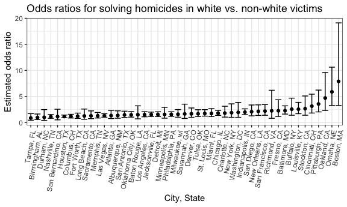
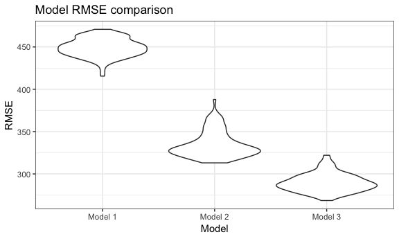

p8105\_hw6\_dry2115
================
Dayoung Yu
2018-11-27

### Problem 1

This problem looks at homicide data across 50 major U.S. cities. Mainly, we will be looking at comparisons between homicides of white victims versus non-white vicitims.

##### Read in and clean *Washington Post* homicide data:

``` r
homicide_df = 
  read_csv("data/homicide-data.csv", na = c("", "NA", "Unknown")) %>%
  mutate(
    city_state = str_c(city, state, sep = ", "),
    resolution = case_when(
      disposition == "Closed without arrest" ~ "unresolved",
      disposition == "Open/No arrest"        ~ "unresolved",
      disposition == "Closed by arrest"      ~ "resolved"),
    victim_race = case_when(
      victim_race != "White" ~ "nonwhite",
      victim_race == "White" ~ "white"),
    victim_age = as.numeric(victim_age)
    ) %>%
  filter(!(city_state %in% c("Dallas, TX", "Phoenix, AZ", "Kansas City, MO", "Tulsa, AL")))
```

The data set homicide\_df contains gathered homicide data in 50 large U.S. cities, e.g., victim name and demographics, location, and disposition (whether case was closed and whether there was an arrest). The following changes were made: a new "city, state" variable was created, a new "resolution" variable was created defining whether the case was resolved or unresolved, and the "victim\_race" was categorized as white or non-white. In addition, some cities were omitted due to missing data and error.

##### Logic regression for Baltimore homicides:

``` r
baltimore_df = homicide_df %>%
  filter(city == "Baltimore") %>%
  mutate(resolved = as.numeric(resolution == "resolved"),
         victim_race = fct_relevel(victim_race, "white")) %>%
  select(resolved, victim_age, victim_sex, victim_race)

baltimore_glm = baltimore_df %>%
  glm(resolved ~ victim_age + victim_sex + victim_race, data = ., family = binomial())

or_baltimore = baltimore_glm %>%
  broom::tidy() %>%
  mutate(OR = exp(estimate)) %>%
  select(term, log_OR = estimate, OR)

ci_baltimore = as.tibble(confint(baltimore_glm)) %>%
  janitor::clean_names() %>%
  select(ci_low = x2_5_percent, ci_high = x97_5_percent) %>%
  mutate(ci_low = exp(ci_low),
         ci_high = exp(ci_high))
## Waiting for profiling to be done...


cbind(or_baltimore, ci_baltimore) %>%
  filter(term == "victim_racenonwhite") %>%
  mutate(term = str_replace(term, "nonwhite", ": non-white")) %>%
  knitr::kable(digits = 3)
```

| term                    |  log\_OR|     OR|  ci\_low|  ci\_high|
|:------------------------|--------:|------:|--------:|---------:|
| victim\_race: non-white |    -0.82|  0.441|    0.312|      0.62|

The table above shows the adjusted odds ratio and 95% confidence interval for solving homicides of non-white victims vs. white victims. Homicide cases of non-white victims have 0.441 times the odds of being resolved compared to homicide cases of white victims, meaning non-white homicides are less likely to be resolved in the city of Baltimore.

##### Logic regression by city:

``` r
city_glm = homicide_df %>%
  mutate(resolved = as.numeric(resolution == "resolved"),
         victim_race = fct_relevel(victim_race, "white")) %>%
  group_by(city_state) %>%
  nest() %>%
  mutate(models = map(data, ~glm(resolved ~ victim_age + victim_sex + victim_race, data = ., family = binomial())),
         models = map(models, broom::tidy)) %>%
  select(-data) %>%
  unnest() %>%
  filter(term == "victim_racenonwhite") %>%
  mutate(OR = exp(estimate),
         ci_low = exp(estimate - 1.96*std.error),
         ci_high = exp(estimate + 1.96*std.error)) %>%
  select(city_state, term, log_OR = estimate, OR, ci_low, ci_high)
  
```

##### Plot of ORs and CIs for each city:

``` r

city_glm %>%
  mutate(city_state = fct_reorder(city_state, OR)) %>%
  ggplot(aes(x = city_state, y = OR)) +
  geom_point() +
  geom_errorbar(aes(ymin = ci_low, ymax = ci_high)) +
  geom_hline(yintercept = 1, color = "red") +
   theme(axis.text.x = element_text(angle = 80, hjust = 1)) +
  labs(
    title = "Odds ratios for solving homicides in non-white vs. white victims",
    x = "City, State",
    y = "Estimated odds ratio"
  )
```



The plot above shows odds ratios and their confidence levels for solving homicides for non-white vs. white victims in 50 major U.S. cities. We can see that odss ratios for all cities except Durham, Birmingham, and Tampa are below 1, meaning that white victims have better odds of having a resolved case than non-white victims in most major U.S. cities. However, about half of the cities contain 1 in their 95% confidence intervals, indicating that for about 50% of the time, there may be no significant difference between solving homicide cases of non-whites versus whites.

### Problem 2

This problem looks at birthweight data to estimate and create models for low birth weight.

##### Read and clean data:

``` r
birthweight_df = 
  read_csv("data/birthweight.csv") %>%
  mutate(babysex = as.factor(babysex),
         frace = as.factor(frace),
         malform = as.factor(malform),
         mrace = as.factor(mrace))
## Parsed with column specification:
## cols(
##   .default = col_integer(),
##   gaweeks = col_double(),
##   ppbmi = col_double(),
##   smoken = col_double()
## )
## See spec(...) for full column specifications.
```

Variables *babysex*, *frace*, *malform*, and *mrace* were converted from integer to factor type.

##### Check for missing values and data distribution:

``` r
skimr::skim(birthweight_df) 
```

The data set had no missing values, birthweight seems normally distributed.

##### Create model for birth weight:

Predictors (mother's weight at delivery, mother's age at delivery, and gestational age) were chosen based on results of a study identifying significant risk factors for low birth weight. The study can be found here: <https://www.ncbi.nlm.nih.gov/pmc/articles/PMC4456878/>

``` r
birthweight_lm = lm(bwt ~ delwt + momage + gaweeks, data = birthweight_df)
  
birthweight_lm %>% broom::tidy()
## # A tibble: 4 x 5
##   term        estimate std.error statistic   p.value
##   <chr>          <dbl>     <dbl>     <dbl>     <dbl>
## 1 (Intercept)  -276.      95.2       -2.90 3.79e-  3
## 2 delwt           5.44     0.310     17.6  1.06e- 66
## 3 momage         10.00     1.77       5.64 1.79e-  8
## 4 gaweeks        60.8      2.19      27.8  2.86e-156

birthweight_df %>%
  modelr::add_residuals(birthweight_lm) %>%
  modelr::add_predictions(birthweight_lm) %>%
  ggplot(aes(x = pred, y = resid)) +
  geom_point(alpha = 0.3) + 
  geom_smooth(se = FALSE) +
  labs(
    title = "Fitted values vs. residuals",
    x = "Fitted Values",
    y = "Residuals"
  ) 
## `geom_smooth()` using method = 'gam' and formula 'y ~ s(x, bs = "cs")'
```


The plot illustrates residuals plotted against predictive values of birthweight. The residuals are mostly symmetrically distributed. However, the curve indicates that there is higher variance for lower birthweights, thus there is low predictive accuracy in our model as weight decreases.

###### Compare with other models:

``` r
compare_lm1 = lm(bwt ~ blength + gaweeks, data = birthweight_df)

compare_lm2 = lm(bwt ~ bhead + blength + babysex +
                      bhead*blength + bhead*babysex + blength*babysex +
                      bhead*blength*babysex, data = birthweight_df)
```

##### Perform cross validation:

``` r
cv_df = crossv_mc(birthweight_df, 100)

cv_df = 
  cv_df %>%
  mutate(birthweight_lm = map(train, ~ lm(bwt ~ delwt + momage + gaweeks, data = .x)),
         compare_lm1 = map(train, ~ lm(bwt ~ blength + gaweeks, data = .x)),
         compare_lm2 = map(train, ~ lm(bwt ~ bhead + blength + babysex +
                                       bhead*blength + bhead*babysex + blength*babysex +
                                       bhead*blength*babysex, data = .x))) %>%
  
  mutate(rmse_birthweight = map2_dbl(birthweight_lm, test, ~rmse(model = .x, data = .y)),
         rmse_compare1 = map2_dbl(compare_lm1, test, ~rmse(model = .x, data = .y)),
         rmse_compare2 = map2_dbl(compare_lm2, test, ~rmse(model = .x, data = .y)))
  
```

##### Plot prediction error distribution for each candidate model:

``` r
cv_df %>% 
  select(starts_with("rmse")) %>% 
  gather(key = model, value = rmse) %>% 
  mutate(model = str_replace(model, "rmse_", ""),
         model = fct_inorder(model),
         model = recode(model, "birthweight" = "Model 1", "compare1" = "Model 2", "compare2" = "Model 3")) %>% 
  ggplot(aes(x = model, y = rmse)) + 
  geom_violin() +
    labs(
    title = "Model RMSE comparison ",
    x = "Model",
    y = "RMSE"
  )
```



``` r

tibble(
  Model = 1:3,
  Predictors = c("bwt ~ delwt + momage + gaweeks",
                 "bwt ~ blength + gaweeks",
                 "bwt ~ bhead + blength + babysex + interactions")
) %>% knitr::kable()
```

|  Model| Predictors                                     |
|------:|:-----------------------------------------------|
|      1| bwt ~ delwt + momage + gaweeks                 |
|      2| bwt ~ blength + gaweeks                        |
|      3| bwt ~ bhead + blength + babysex + interactions |

The violin plot above indicates that Model 1, which is the estimate model using risk factors identified by a previous study, has highest RMSE and therefore, the least predictive accuracy. Even though the study tested many of the variables listed in our birthweight dataset and found them insignificant, the model comparison illustrates that baby's head circumference, length, sex, and their interactions should be included in the model for more accurate birthweight prediction. Thus, based on RMSE, Model 3 should be chosen.
