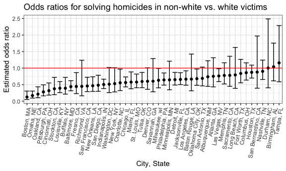

p8105\_hw5\_dry2115
================
Dayoung Yu
2018-11-26

### Problem 1

Read in and clean *Washington Post* homicide data:

``` r
homicide_df = 
  read_csv("data/homicide-data.csv", na = c("", "NA", "Unknown")) %>%
  mutate(
    city_state = str_c(city, state, sep = ", "),
    resolution = case_when(
      disposition == "Closed without arrest" ~ "unresolved",
      disposition == "Open/No arrest"        ~ "unresolved",
      disposition == "Closed by arrest"      ~ "resolved"),
    victim_race = case_when(
      victim_race == "White" ~ "white",
      victim_race != "White" ~ "non-white"),
    victim_age = as.numeric(victim_age)
    ) %>%
  filter(!(city_state %in% c("Dallas, TX", "Phoenix, AZ", "Kansas City, MO", "Tulsa, AL")))
## Parsed with column specification:
## cols(
##   uid = col_character(),
##   reported_date = col_integer(),
##   victim_last = col_character(),
##   victim_first = col_character(),
##   victim_race = col_character(),
##   victim_age = col_integer(),
##   victim_sex = col_character(),
##   city = col_character(),
##   state = col_character(),
##   lat = col_double(),
##   lon = col_double(),
##   disposition = col_character()
## )
```

The data set homicide\_df contains gathered homicide data in 50 large U.S. cities, e.g., victim name and demographics, location, and disposition (whether case was closed and whether there was an arrest). The following changes were made: a new "city, state" variable was created, a new "resolution" variable was created defining whether the case was resolved or unresolved, and the "victim\_race" was categorized as white or non-white. In addition, some cities were omitted due to missing data and error.

Logic regression for Baltimore homicides:

``` r
baltimore_df = homicide_df %>%
  filter(city == "Baltimore") %>%
  mutate(resolved = as.numeric(resolution == "resolved")) %>%
  select(resolved, victim_age, victim_sex, victim_race)

baltimore_glm = baltimore_df %>%
  glm(resolved ~ victim_age + victim_sex + victim_race, data = ., family = binomial())

or_baltimore = baltimore_glm %>%
  broom::tidy() %>%
  mutate(OR = exp(estimate)) %>%
  select(term, log_OR = estimate, OR)

ci_baltimore = as.tibble(confint(baltimore_glm)) %>%
  janitor::clean_names() %>%
  select(ci_low = x2_5_percent, ci_high = x97_5_percent) %>%
  mutate(ci_low = exp(ci_low),
         ci_high = exp(ci_high))
## Waiting for profiling to be done...


cbind(or_baltimore, ci_baltimore) %>%
  filter(term == "victim_racewhite") %>%
  mutate(term = str_replace(term, "white", ": White")) %>%
  knitr::kable(digits = 3)
```

| term                |  log\_OR|    OR|  ci\_low|  ci\_high|
|:--------------------|--------:|-----:|--------:|---------:|
| victim\_race: White |     0.82|  2.27|    1.614|     3.203|

The table above shows the adjusted odds ratio and 95% confidence interval for solving homicides of whites vs. non-whites. Homicide cases of white victims have 2.27 times the odds of being resolved compared to homicide cases of non-white victims in the city of Baltimore.

Logic regression by city:

``` r
city_glm = homicide_df %>%
  mutate(resolved = as.numeric(resolution == "resolved")) %>%
  group_by(city_state) %>%
  nest() %>%
  mutate(models = map(data, ~glm(resolved ~ victim_age + victim_sex + victim_race, data = ., family = binomial())),
         models = map(models, broom::tidy)) %>%
  select(-data) %>%
  unnest() %>%
  filter(term == "victim_racewhite") %>%
  mutate(OR = exp(estimate),
         ci_low = exp(estimate - 1.96*std.error),
         ci_high = exp(estimate + 1.96*std.error)) %>%
  select(city_state, term, log_OR = estimate, OR, ci_low, ci_high)
  
```

plot of ORs and CIs for each city

``` r

city_glm %>%
  mutate(city_state = fct_reorder(city_state, OR)) %>%
  ggplot(aes(x = city_state, y = OR)) +
  geom_point() +
  geom_errorbar(aes(ymin = ci_low, ymax = ci_high)) +
   theme(axis.text.x = element_text(angle = 80, hjust = 1)) +
  labs(
    title = "Odds ratios for solving homicides in white vs. non-white victims",
    x = "City, State",
    y = "Estimated odds ratio"
  )
```



The plot above shows odds ratios and their confidence levels for solving homicides for white vs. non-white victims in 50 major U.S. cities. We can see that all odss ratios and confidence intervals are above zero, meaning that white victims have better odds of having a resolved case than non-white victims in all 50 major cities. The difference in odds between white and non-white victims is highest in Boston, but the confidence interval is also the widest meaning there is greater variance.

### Problem 2

Read and clean data:

``` r
birthweight_df = 
  read_csv("data/birthweight.csv") %>%
  mutate(babysex = as.factor(babysex),
         frace = as.factor(frace),
         malform = as.factor(malform),
         mrace = as.factor(mrace))
## Parsed with column specification:
## cols(
##   .default = col_integer(),
##   gaweeks = col_double(),
##   ppbmi = col_double(),
##   smoken = col_double()
## )
## See spec(...) for full column specifications.
```

Variables *babysex*, *frace*, *malform*, and *mrace* were converted from integer to factor type.

Check for missing values:

``` r
skimr::skim(birthweight_df) 
## Skim summary statistics
##  n obs: 4342 
##  n variables: 20 
## 
## ── Variable type:factor ──────────────────────────────────────────────────────────────────────────────────────────────
##  variable missing complete    n n_unique                      top_counts
##   babysex       0     4342 4342        2         1: 2230, 2: 2112, NA: 0
##     frace       0     4342 4342        5 1: 2123, 2: 1911, 4: 248, 3: 46
##   malform       0     4342 4342        2           0: 4327, 1: 15, NA: 0
##     mrace       0     4342 4342        4 1: 2147, 2: 1909, 4: 243, 3: 43
##  ordered
##    FALSE
##    FALSE
##    FALSE
##    FALSE
## 
## ── Variable type:integer ─────────────────────────────────────────────────────────────────────────────────────────────
##  variable missing complete    n      mean     sd  p0  p25    p50  p75 p100
##     bhead       0     4342 4342   33.65     1.62  21   33   34     35   41
##   blength       0     4342 4342   49.75     2.72  20   48   50     51   63
##       bwt       0     4342 4342 3114.4    512.15 595 2807 3132.5 3459 4791
##     delwt       0     4342 4342  145.57    22.21  86  131  143    157  334
##   fincome       0     4342 4342   44.11    25.98   0   25   35     65   96
##  menarche       0     4342 4342   12.51     1.48   0   12   12     13   19
##   mheight       0     4342 4342   63.49     2.66  48   62   63     65   77
##    momage       0     4342 4342   20.3      3.88  12   18   20     22   44
##    parity       0     4342 4342    0.0023   0.1    0    0    0      0    6
##   pnumlbw       0     4342 4342    0        0      0    0    0      0    0
##   pnumsga       0     4342 4342    0        0      0    0    0      0    0
##      ppwt       0     4342 4342  123.49    20.16  70  110  120    134  287
##    wtgain       0     4342 4342   22.08    10.94 -46   15   22     28   89
##      hist
##  ▁▁▁▁▅▇▁▁
##  ▁▁▁▁▁▇▁▁
##  ▁▁▁▃▇▇▂▁
##  ▁▇▅▁▁▁▁▁
##  ▁▂▇▂▂▂▁▃
##  ▁▁▁▁▂▇▁▁
##  ▁▁▁▅▇▂▁▁
##  ▂▇▅▂▁▁▁▁
##  ▇▁▁▁▁▁▁▁
##  ▁▁▁▇▁▁▁▁
##  ▁▁▁▇▁▁▁▁
##  ▁▇▆▁▁▁▁▁
##  ▁▁▁▇▇▁▁▁
## 
## ── Variable type:numeric ─────────────────────────────────────────────────────────────────────────────────────────────
##  variable missing complete    n  mean   sd    p0   p25   p50   p75 p100
##   gaweeks       0     4342 4342 39.43 3.15 17.7  38.3  39.9  41.1  51.3
##     ppbmi       0     4342 4342 21.57 3.18 13.07 19.53 21.03 22.91 46.1
##    smoken       0     4342 4342  4.15 7.41  0     0     0     5    60  
##      hist
##  ▁▁▁▁▃▇▁▁
##  ▁▇▅▁▁▁▁▁
##  ▇▁▁▁▁▁▁▁
```

The data set had no missing values

Create model for birth weight: Predictors were chosen based on results of a study identifying significant risk factors for low birth weight. The study can be found here: <https://www.ncbi.nlm.nih.gov/pmc/articles/PMC4456878/>

``` r
birthweight_lm = lm(bwt ~ delwt + momage + gaweeks, data = birthweight_df)
  
birthweight_lm %>% broom::tidy()
## # A tibble: 4 x 5
##   term        estimate std.error statistic   p.value
##   <chr>          <dbl>     <dbl>     <dbl>     <dbl>
## 1 (Intercept)  -276.      95.2       -2.90 3.79e-  3
## 2 delwt           5.44     0.310     17.6  1.06e- 66
## 3 momage         10.00     1.77       5.64 1.79e-  8
## 4 gaweeks        60.8      2.19      27.8  2.86e-156

birthweight_df %>%
  modelr::add_residuals(birthweight_lm) %>%
  modelr::add_predictions(birthweight_lm) %>%
  ggplot(aes(x = resid, y = pred)) +
  geom_point() 
```


compare with other models

``` r
compare_lm1 = lm(bwt ~ blength + gaweeks, data = birthweight_df)

compare_lm2 = lm(bwt ~ bhead + blength + babysex +
                      bhead*blength + bhead*babysex + blength*babysex +
                      bhead*blength*babysex, data = birthweight_df)
```

cross validation

``` r
cv_df = crossv_mc(birthweight_df, 100)

cv_df = 
  cv_df %>%
  mutate(birthweight_lm = map(train, ~ lm(bwt ~ delwt + momage + gaweeks, data = .x)),
         compare_lm1 = map(train, ~ lm(bwt ~ blength + gaweeks, data = .x)),
         compare_lm2 = map(train, ~ lm(bwt ~ bhead + blength + babysex +
                                       bhead*blength + bhead*babysex + blength*babysex +
                                       bhead*blength*babysex, data = .x))) %>%
  
  mutate(rmse_birthweight = map2_dbl(birthweight_lm, test, ~rmse(model = .x, data = .y)),
         rmse_compare1 = map2_dbl(compare_lm1, test, ~rmse(model = .x, data = .y)),
         rmse_compare2 = map2_dbl(compare_lm2, test, ~rmse(model = .x, data = .y)))
  
```

plot prediction error distribution for each candidate model

``` r
cv_df %>% 
  select(starts_with("rmse")) %>% 
  gather(key = model, value = rmse) %>% 
  mutate(model = str_replace(model, "rmse_", ""),
         model = fct_inorder(model)) %>% 
  ggplot(aes(x = model, y = rmse)) + geom_violin()
```


